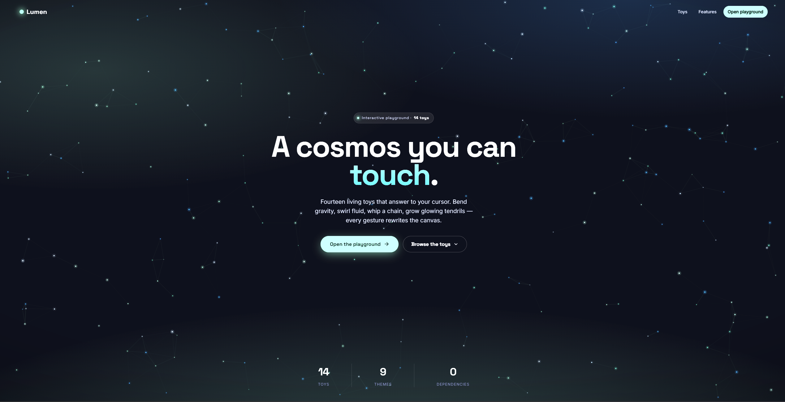

# Hashir Rana — Portfolio

Grade 10 student in Ontario. I build web apps, games, and AI projects.
Working toward AI Engineering.

## Projects

Lumen is a single-file interactive art experience built entirely in vanilla JavaScript and HTML5 Canvas.

The landing page showcases all 14 toys with live animated previews. 

The full-screen playground lets you sculpt a living canvas with your cursor or touch.

**14 toys include:** Cosmos, Flow, Silk, Orbits, Ripple, Bloom, Lattice, Swarm, Aurora, Fluid, Chain, Magnet, Spiral, Tendrils

**12 themes include:** Aurora, Ember, Nebula, Glacier, Sakura, Citron, Mono, Sunset, Toxic, Oceanic, Noir, Rainbow

Built with performance in mind — spatial grids, capped trails, and auto-pause when hidden. Fully touch-responsive.

- **BYTE** — Pixel-art productivity companion app

## Client Work
- Cellrox Canada Inc. — custom business website
- Big Tech Guys — custom business website
- Stars Salon — custom business website
  
## Certificates
- DataCamp — [Introduction to Python (2026) ](certificate.pdf) ✅
- DataCamp — Intermediate Python (2026) — in progress

## Skills
JavaScript · Three.js · React · Node.js · Python · HTML/CSS · Netlify · Git
