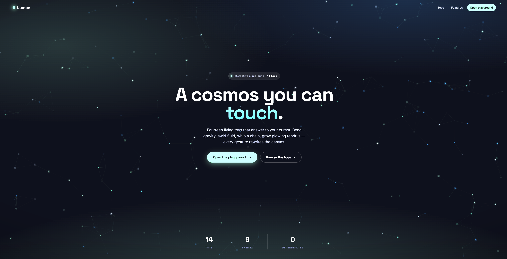

# Hashir Rana
**Grade 10 · Ontario, Canada**  
Aspiring AI Engineer · Building toward University of Waterloo Computer Science / AI Engineering

---

## About Me

I'm a self-taught developer who builds real things — browser games, generative art, full-stack apps, and AI-powered tools. I started coding independently and currently run a small web design business serving local businesses in Ontario.

I'm passionate about the intersection of AI and software engineering, and I'm actively working toward a career in AI engineering through hands-on projects and structured learning.

---

## Projects

### Lumen — Generative Art Playground
> *A cosmos you can touch.*

A fully self-contained interactive art experience built in vanilla JavaScript and HTML5 Canvas — no libraries, no dependencies, one file.

- **14 interactive toys:** Cosmos, Flow, Silk, Orbits, Ripple, Bloom, Lattice, Swarm, Aurora, Fluid, Chain, Magnet, Spiral, Tendrils
- **12 themes:** Aurora, Ember, Nebula, Glacier, Sakura, Citron, Mono, Sunset, Toxic, Oceanic, Noir, Rainbow
- Landing page with live animated toy previews
- Full-screen playground with cursor and touch support
- Performance-optimized: spatial grids, capped trails, auto-pause when hidden

🔗 [Live Demo](https://lumentoys.netlify.app)

---

THE LAST REEL

A 1930s rubber-hose cartoon metroidvania that runs in a single HTML file. No engine, no libraries, no image or audio assets — every frame is drawn with Canvas 2D paths and every sound is synthesized with the Web Audio API at runtime.

▶ Play it · ~7,700 lines of vanilla JavaScript · 420 KB, one file, zero dependencies

The game

Fleischer & Sons Ink Works went dark overnight in 1932 and nobody ever said why. You play SPARKY, a cream-and-gold lightbulb with pie eyes, walking back into the studio eighty years later to find out what happened to the picture they never finished.

Fifteen headliners are still on the lot, each holding a reel of the story. Beat one and its film canister rolls loose. Thread it in the Screening Room and you get a fragment of what actually went on here — and the answer is worse than the studio just closing.

88 rooms across 16 hand-authored areas — a garden lot, a night pier, a big top, a projection booth, a pixel reel, a furnace level, a cutting room, an orchestra pit, an ink swamp, a clockwork attic, a frozen shoot, a storm stage, a hall of mirrors, the ink & paint department, and the vault at the end of it
15 boss fights, each with three distinct acts, its own attack patterns, and a death animation in its own material — the Colorist goes out in every colour at once; the Understudy shatters back into glass
29 enemy types with individual AI: shards that hang still and then knife at you, mimics that walk mirrored to your input, brushes that sweep down and flick paint
9 unlockable abilities — dash, double jump, ground slam, glide, ember, lantern, metronome, and two that change how you shoot: mirrored twin shots and piercing prism rounds
15 silent-film cutscenes with intertitle cards, film grain, sepia, and scratches — the credits at the end use your name
Boss Rush mode against all fifteen on one health bar, with a saved best time
Technical notes

The interesting constraint was one file, nothing external. Everything follows from that:

Procedural art. There are no sprites. Every character, boss, background, and particle is drawn each frame from bezier and arc paths — rubber-hose limbs are constructed from tapered curves, faces from layered pie-eyes with tracking pupils. Bosses are built from a shared body function plus per-phase geometry, so a three-act fight is three drawing functions over one skeleton.

Procedural audio. No audio files. A small Web Audio layer synthesizes every effect from oscillators and filtered noise, and each of the 16 areas has its own motif — a chord progression and melody table played back at its own tempo, so the music changes when you change worlds.

World generation over authored layouts. Rooms are hand-designed for their core geometry, then a generation pass extends them, scatters additional platforms and hazards, and populates enemies from a per-area pool weighted to that world. Hub, boss arenas, and the Screening Room are excluded so their layouts stay exact.

Headless test harness. Because it's a canvas game with no DOM to assert against, I wrote a Node.js harness that stubs the entire canvas context behind a Proxy, stubs localStorage and requestAnimationFrame, then evaluates the game source and drives it frame by frame. It exercises all 88 rooms, all 15 boss intros and phase transitions, every cutscene through every scene, all door links, and checks that every enemy type is actually killable and every gated room is actually clearable. That last suite caught two genuine softlocks — an armored enemy whose vulnerability window never opened, in a room that required more kills than there were killable enemies.

Performance build. A second build adds an adaptive quality mode: it samples frame time on startup and, if the machine is struggling, drops to native resolution rendering, thins particle spawns with a hard cap, and simplifies parallax and cloud layers. Toggleable at runtime with an on-screen FPS readout.

Running it

Download the HTML file and open it in a browser. That's the whole install.

Controls — WASD move · mouse aim and fire · E swat/parry · Space jump · Shift dash · Tab map · G graphics toggle (laptop build)

Built with

Vanilla JavaScript, Canvas 2D, Web Audio API. No frameworks, no build step, no dependencies.

---

## Client Work

Independent web design work for local Ontario businesses:

| Client | Description |
|---|---|
| Cellrox Canada Inc. | Custom business website |
| Big Tech Guys | Custom business website |
| Stars Salon | Custom business website |

---

## Certificates & Learning

### Completed
- ✅ DataCamp — [Introduction to Python (2026)](https://github.com/HashirRana-alt/Portfolio/blob/main/certificate.pdf)

### In Progress
- 🔄 DataCamp — Intermediate Python

### AI Engineer for Developers Track *(upcoming)*
9-course track covering the full AI engineering stack:

| # | Course | Status |
|---|---|---|
| 1 | Working with the OpenAI API | 📋 Upcoming |
| 2 | Prompt Engineering with the OpenAI API | 📋 Upcoming |
| 3 | Working with Hugging Face | 📋 Upcoming |
| 4 | LLMOps Concepts | 📋 Upcoming |
| 5 | Developing AI Systems with the OpenAI API | 📋 Upcoming |
| 6 | Introduction to Embeddings with the OpenAI API | 📋 Upcoming |
| 7 | Vector Databases for Embeddings with Pinecone | 📋 Upcoming |
| 8 | Software Engineering Principles in Python | 📋 Upcoming |
| 9 | Developing LLM Applications with LangChain | 📋 Upcoming |

### Also Upcoming
- 📋 DataCamp — AI Fundamentals

---

## Skills

**Languages:** JavaScript · Python · HTML · CSS  
**Frameworks & Libraries:** Three.js · React · Node.js · Express  
**Tools:** Git · GitHub · Netlify · VS Code · SQLite  
**Currently learning:** Python · Machine Learning · LLM APIs

---

## Goals

- Complete DataCamp AI Engineer for Developers track by end of 2026
- Build and deploy 2–3 AI-powered projects this year
- Apply to University of Waterloo CS / SE / CE (2028)
- Pursue a career in AI engineering

---

*Last updated: July 2026*
